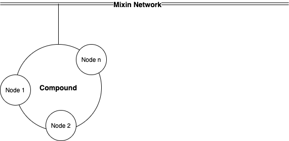
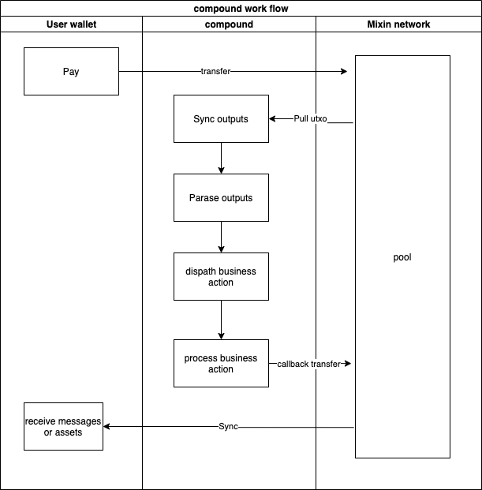

# Design

## Architecture

Compound is an implementation of MTG and a parachain of Mixin network.



* The user transfer a payment(UTXO) that carries business data to the Mixin network.
* Compound sync the outputs(UTXO), parses the business data(in output.memo)
* Compound dispatchs the business action(included in business data) and processes each action(supply, borrow...)



## Code struct

```

---
|-cmd      
|-config  
|-deploy  
|-docs    
|-core 
|-pkg     
|-service 
|-store   
|-worker  
|-handler    
|-Dockerfile 
|-Makefile
|-main.go 

```

* [cmd](../cmd) command entry, including start api server and worker and governance tools
* [config](../config) default config directory
* [docs](../docs) project documents
* [core](../core) directory of project's models
* [pkg](../pkg) project packages that can be exported
* [service](../service) directory of business codes
* [store](../store) data repository(data may be stored in database or redis or memory cache)
* [worker](../worker) directory for jobs that processing data in background
* [handler](../handler) just for exported apis
* [Dockerfile](../Dockerfile) for deployment
* [deploy](../deploy) store configs and tools of deployment
* [main.go](../main.go)
* [Makefile](../Makefile)

### [configuration template](../deploy/config.node.yaml.tpl)

```
# genesis timestamp in second
genesis: 1603382400
location: Asia/Shanghai

db:
  dialect: mysql
  host: ~
  read_host: ~
  port: 3306
  user: ~
  password: ~
  database: ~
  location: Asia%2FShanghai
  debug: true

# It is recommended that each node configure its own price service
price_oracle:
  end_point: https://poracle-dev.fox.one

dapp:
  num: 7000103159
  client_id: ~
  session_id: ~
  client_secret: ~
  pin_token: ~
  pin: ""
  private_key: ~

group:
# private key shared by all nodes
  private_key: ~
  # The private key of the node user to sign the data
  sign_key: ~
  # node admins
  admins:
    - ~
    - ~
    - ~ 
  # all nodes
  members:
  # node id
    - client_id: ~
    # The public key used by the node to verify the signature
      verify_key: ~
  # multi-sign threshold
  threshold: 2

  vote:
    asset: 965e5c6e-434c-3fa9-b780-c50f43cd955c
    amount: 0.00000001
```

#### [Rest APIs](../handler/rest/rest.go) exported for application layer, including:

```
/markets   //response all markets
/markets/{asset} // response the market info of the specified asset
/liquidities/{address} //response user liquidities
/supplies //response supply datas
/borrows // response borrow datas
/transactions // response transactions
```

#### Worker
* [cashier](../worker/cashier/cashier.go) Processes the pending transfers. prepare for transfering a transaction to Mixin network.
* [syncer](../worker/syncer/syncer.go) Syncs the outputs(UTXO) from Mixin network.
* [txsender](../worker/txsender/sender.go) Transfers raw transaction to Mixin network.
* [spentsync](../worker/spentsync/spentsync.go) syncs and updates the transfer state.
* [priceoracle](../worker/priceoracle/priceoracle.go) Fetches a price and put the price on the chain.
* [payee](../worker/snapshot/payee.go) processes outputs and dispatches business actions.

#### Action processing
* [borrow](../worker/snapshot/borrow.go) handles the borrow action event.
* [supply](../worker/snapshot/supply.go) handles the supply action event.
* [pledge](../worker/snapshot/supply_pledge.go) handles the pledge action event.
* [unpledge](../worker/snapshot/supply_unpledge.go) handles the unpledge action event.
* [redeem](../worker/snapshot/supply_redeem.go) handles the redeem action event.
* [repay](../worker/snapshot/borrow_repay.go) handles the repay action event.
* [liquidation](../worker/snapshot/liquidation.go) handles the liquidation action event
* [proposal](../worker/snapshot/proposal.go) handles and dispatches the proposal actions, include: adding market, updating market, closing or opening market, adding or removing allowlist, withdraw
* [price](../worker/snapshot/price.go) handles the price protocal action event.


### Price oracle 
Price oracle uses the following methods to ensure the document of market price

* Every node should deploy its own price oracle server.
* Each node obtains the average price of the specified market within 1 hour through the price oracle service as the price provided by the current node and writes it on the main chain.
* The compound uses m/n multi-signature to ensure that the price provided by at least m nodes of n nodes is valid before the price of the current block of the market is valid.
	1. Sorts the prices provided by all nodes in ascending order of price.
	2. Comparing adjacent prices, the price difference >=5% is invalid
	3. If the remaining price meets the multi-sign m/n requirement, the price is valid this time.
	4. Calculate the average value of m prices as the current block price in the market.
* When the price is maliciously attacked, since the average price within 1 hour is used as the market price, the malicious price has limited impact on the market. At the same time, managers can decide whether it is necessary to `close-market` at the same time. After restoration of `open-market`.

### Market fuse protection

> Close the market when the price of a certain market is abnormal.

* When the price of a market is maliciously attacked, managers have the right to execute the `close-market` order and apply for a closed-market vote. If the vote is passed, the market will be closed.
* Closed markets cannot be traded.
* However, when at least one market is closed, liquidation of all markets will be prohibited, because liquidation will affect the liquidity of all market accounts of users.

## The implementation of compound protocol 

* [Interest rate model](../internal/compound/interest_rate_model.go) is The core implementation of compound protocol.

* [Borrow balance](../core/borrow.go) user borrow balance contains borrow principal and borrow interest. `balance = borrow.principal * market.borrow_index / borrow.interest_index`

* [Accrue interest](../service/market/market.go) Accruing interest only occurs when there is a behavior that causes changes in market transaction data, such as supply, borrow, pledge, unpledge, redeem, repay, price updating. And Only calculated once in the same block.

```
	blockNumberPrior := market.BlockNumber

	blockNum, e := s.blockSrv.GetBlock(ctx, time)
	if e != nil {
		return e
	}

	blockDelta := blockNum - blockNumberPrior
	if blockDelta > 0 {
		borrowRate, e := s.curBorrowRatePerBlockInternal(ctx, market)
		if e != nil {
			return e
		}

		if market.BorrowIndex.LessThanOrEqual(decimal.Zero) {
			market.BorrowIndex = borrowRate
		}

		timesBorrowRate := borrowRate.Mul(decimal.NewFromInt(blockDelta))
		interestAccumulated := market.TotalBorrows.Mul(timesBorrowRate)
		totalBorrowsNew := interestAccumulated.Add(market.TotalBorrows)
		totalReservesNew := interestAccumulated.Mul(market.ReserveFactor).Add(market.Reserves)
		borrowIndexNew := market.BorrowIndex.Add(timesBorrowRate.Mul(market.BorrowIndex))

		market.BlockNumber = blockNum
		market.TotalBorrows = totalBorrowsNew.Truncate(16)
		market.Reserves = totalReservesNew.Truncate(16)
		market.BorrowIndex = borrowIndexNew.Truncate(16)
	}

```